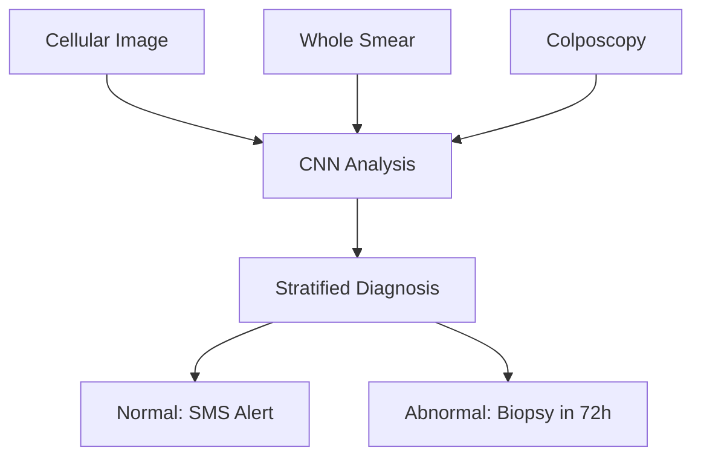
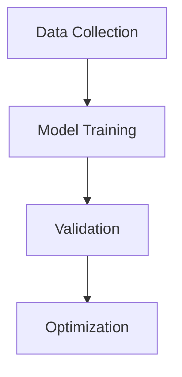
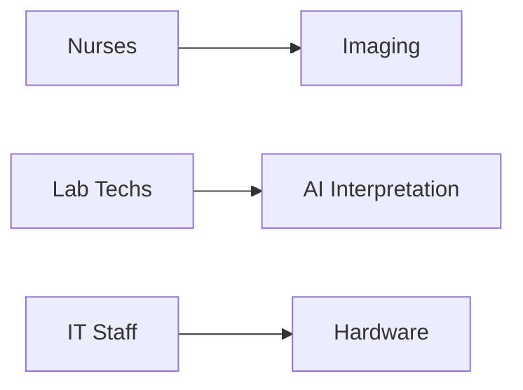
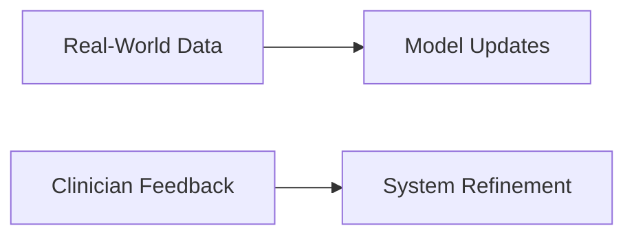
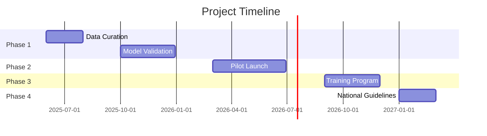

### CerVixAI: AI-Powered Cervical Cancer Screening for Cameroon  
**A Clear Roadmap to Save Lives Through Innovation**  

---

#### 🎯 **1. The Challenge**  
*Cervical cancer kills 1,787 Cameroonian women yearly due to:*  
- 🚫 **Critical specialist shortage** (only 1 pathologist per 500k people)  
- ⏳ **3-week diagnostic delays** causing lost follow-ups  
- 🧪 **Subjective screening** (VIA misses 20-40% of precancerous lesions)  

---

#### 🚀 **2. Our Solution: CerVixAI**  
*A 3-Tier AI System That Works Like This:*  

---

### CerVixAI: AI-Powered Cervical Cancer Screening  
**A Clear 4-Phase Methodology for Cameroon**  

---

#### 🔍 **Methodology Overview**  

---

#### 🧠 **Phase 1: AI Development (Months 1-8)**  
**Core Components:**  

1. **Data Strategy**  
   - 5,000+ global images (Helev, SIPaKMeD)  
   - 500 local Cameroonian samples  
   - Active learning: Pathologists review only ambiguous cases  

2. **AI Architecture**  
   - ResNet-50 backbone with triple-output heads:  
     - Cellular analysis (Bethesda system)  
     - Whole-smear classification  
     - Colposcopy grading  
   - Bias mitigation: Oversampling for HIV+/rural cohorts  

3. **Edge Optimization**  
   - Model compression (FP32 → INT8)  
   - <2 sec/image processing on Intel NUC  

---

#### 🏥 **Phase 2: Pilot Deployment (Months 9-16)**  
**Clinical Workflow:**  

| **Step**               | **Technology**          | **Time Savings**      |
|------------------------|-------------------------|-----------------------|
| 1. Cervical sample     | VIA-compatible brushes  | -                     |
| 2. Digital imaging     | 40x microscopy          | -                     |
| 3. Batch processing    | SMCM (20-50 images)     | 21 days → 90 minutes  |
| 4. Result notification | Automated SMS           | Instant alert         |

**Safety Protocols:**  
- Pathologist review for <85% confidence predictions  
- Encrypted offline data storage  
- Solar-powered backup systems  

---

#### 👩‍⚕️ **Phase 3: Capacity Building (Months 17-20)**  
**Training Framework:**  

**Training Modules:**  
1. **Digital Imaging (12 Nurses)**  
   - Slide preparation standards  
   - Artifact avoidance techniques  
2. **AI Interpretation (6 Lab Techs)**  
   - Risk category recognition  
   - Error case documentation  
3. **Device Management (2 IT Staff)**  
   - Troubleshooting guides  
   - Encrypted backup procedures  

**Certification:** MoH-accredited "Digital Screening Specialist"  

---

#### 📈 **Phase 4: Scale-Up (Months 21-32)**  
**Optimization Cycle:**  

**Scale-Up Strategy:**  
1. **Performance Tracking**  
   - Real-time dashboards monitoring:  
     - Sensitivity/specificity  
     - Turnaround times  
     - Hardware reliability  
2. **Model Evolution**  
   - Monthly threshold tuning  
   - Quarterly full retraining  
3. **National Expansion**  
   - 200 edge devices to 10 districts  
   - Revised clinical guidelines  

---

#### ⏱️ **Timeline & Milestones**  

---

#### 📊 **Key Performance Metrics**  
| **Indicator**         | **Baseline** | **Target**   |
|------------------------|--------------|--------------|
| Screening capacity     | 2,770/yr     | 10,270/yr    |
| Diagnosis turnaround   | 21 days      | 24 hours     |
| Sensitivity            | 70%          | >90%         |
| Trained HCWs           | 0            | 20           |

---

#### ⚙️ **Technical Specifications**  
| **Component**       | **Solution**                     | **Resource Adaptation**       |
|---------------------|----------------------------------|-------------------------------|
| Hardware            | Intel NUC mini-PCs               | Solar-compatible UPS backup   |
| Data Storage        | SQLite + encrypted drives        | Offline operation capable     |
| Power Management    | Automated checkpointing          | Every 50 batches              |
| Connectivity        | DHIS2 sync when available        | SMS fallback system           |

---

**Next Steps:**  
_Contact Ndichia Oriel Loh at ORIINE to access full technical documentation and implementation toolkit._  

> "Precision diagnostics shouldn't require premium resources - just smart technology in dedicated hands."
